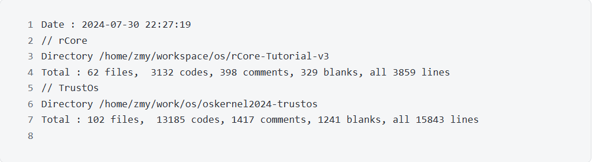
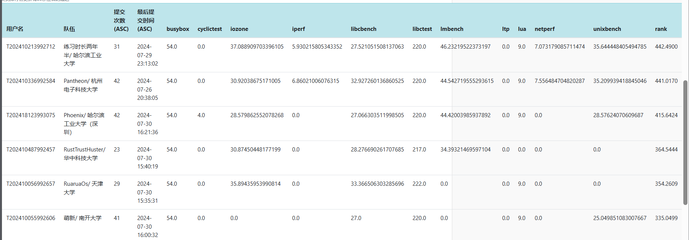

# OSKernel2024-TrustOS

## TrustOS启动
TrustOs是由华中科技大学21级学生郑卯杨,张晨皓,翁哲宇使用rust语言编写的宏内核操作系统。

RustTrushHuster队在rCore-Tutorial Chapter6的基础上,重构内存管理, 实现多线程并发控制和信号机制, 移植对接LwExt4文件系统, 添加修改系统调用以满足POSIX标准,并实现了文件缓存,块缓存,内存懒分配等优化,最终编写出了TrustOS。  

截止至2024.7.30, 除去文件系统外, rCore chapter_6共计62个文件, 3132行代码; TrustOS final_main 分支共计102个文件,13185行代码。   

TrustOS由rCore原有的11个非POSIX的syscall拓展到105个满足POSIX标准的syscall。

在复赛排行榜中排名第五，分数为393.6069

## 人员分工
* 郑卯杨: 进程管理,VFS,Ext4文件系统,信号处理,上板
* 张晨皓: fat32文件系统,设备与抽象文件管理,时间调用,IO优化
* 翁哲宇: 内存管理，环境配置
