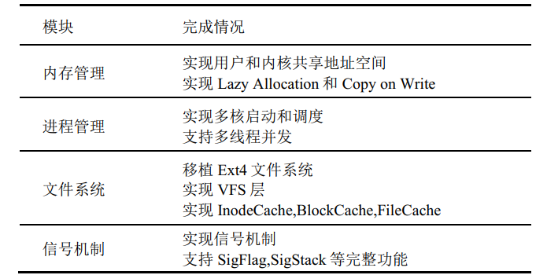
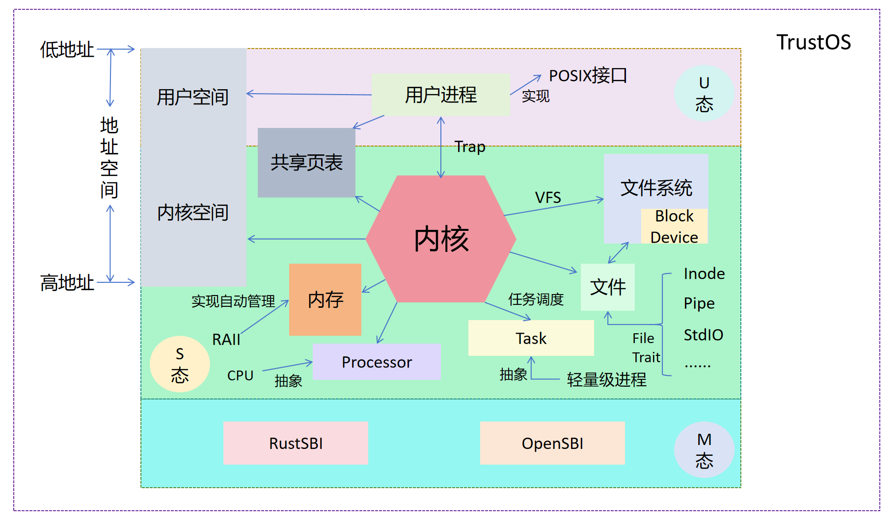
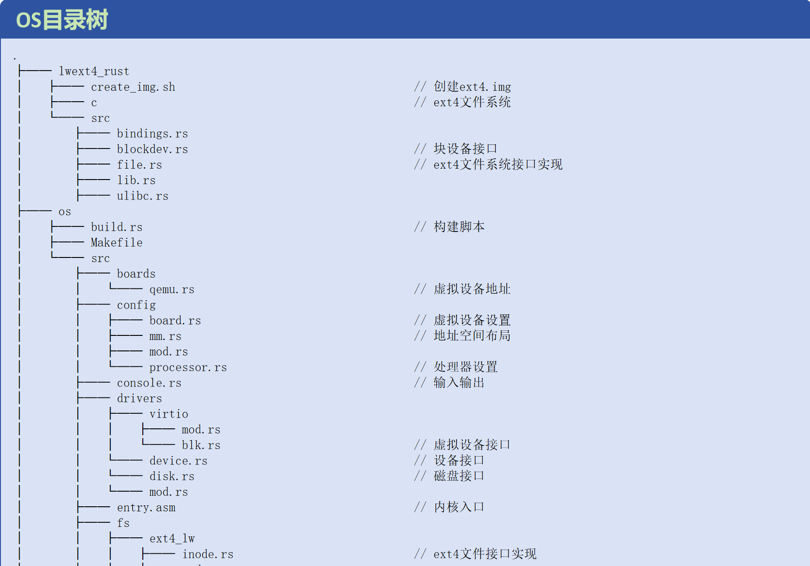
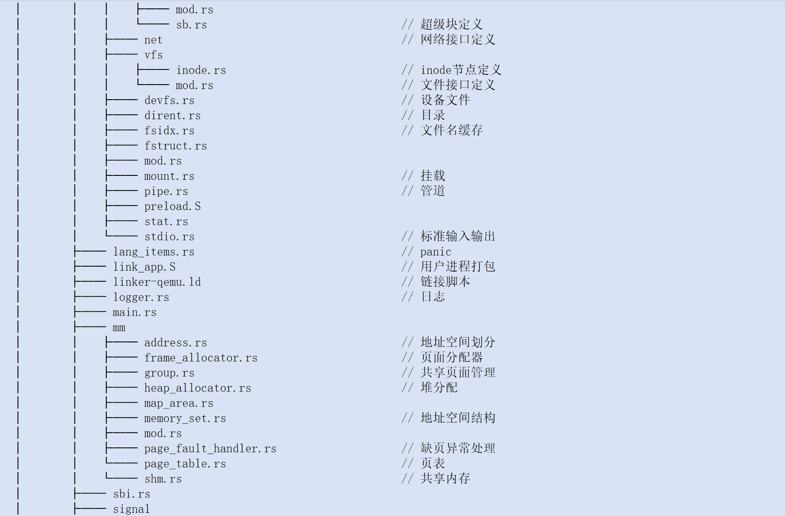
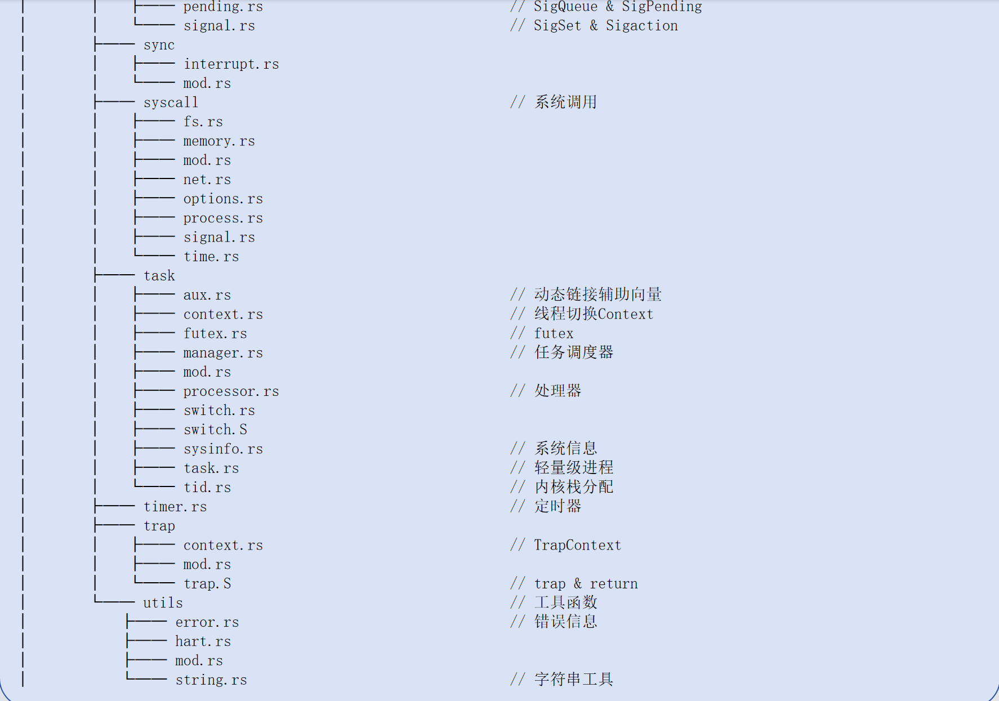

# 1 概述
## 1.1 TrustOs介绍
* TrustOs是Rust编写的基于RISC-V的多核宏内核操作系统。以rCore-Tutorial Chapter6为基础, 重构内存管理, 实现并发控制和信号机制, 移植Fat32文件系统, 添加修改系统调用以满足POSIX标准。目前已经通过初赛全部测试。  
* 选用Rust而非C作为开发语言,  是因为Rust在系统编程领域具有得天独厚的优势, 它天然地保证了程序的内存安全和线程安全, 能够帮助我们规避内核开发中的诸多潜在问题, 同时Rust具有丰富的开源库, 以及完善的开发工具, 让我们能避免重复造轮子, 将精力集中在构建一个快速, 高效, 稳定, 健壮易用的操作系统。
* 基于rCore-Tutorial Chapter6是因为该系统已经实现了初步的内存管理, 进程管理以及一个简易的文件系统, 具有良好的可拓展性。

已经实现的模块如下图所示

## 1.2 TrustOs整体架构
如图所示

*   M态代理给RustSBI/OpenSBI   
*   OS运行在S态。 
    1. 在Block Device的基础上构建起了文件系统, 文件系统通过VFS接入OS。通过File Trait将Inode, Pipe, StdIO统一为文件。
    2. 将地址空间划分为高低两部分, 内核位于高地址, 用户空间位于低地址, 用户和内核共享页表, 通过trap机制陷入内核, 返回用户空间。
    3. 通过RAII实现了内存的自动管理
    4. 将CPU抽象为Processor, 将轻量级进程抽象为Task, 通过调度队列实现任务轮换。
*   用户进程位于U态。通过POSIX接口, 构建用户进程
## 1.3 TrustOs项目结构
如下图所示

