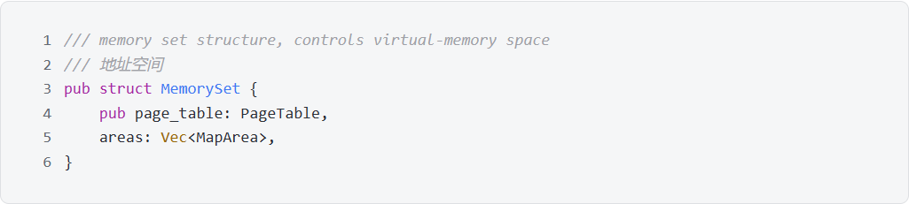

# 2 内存管理

## 2.1 地址空间划分
### 2.1.1 设计思路
在TrustOs 中, 内核和用户共享地址空间, 因此在陷入内核和返回用户态时不需要像 rCore-tutorial 那样进行切换 pagetable, 也不需要 trampoline 页面, 只需要正常跳转即可, 只有在不同的进程进行切换时才需要切换 pagetable。对于内核的地址空间, 我们采用直接映射; 对于用户的地址空间, 我们采用物理页帧随机映射。
### 2.1.2 地址空间
在 QEMU 平台上, 内核的入口物理地址被设置为 0x8020_0000, 即内核代码的二进制文件会被加载到内存中从物理地址 0x8020_0000 开始的空间。因为一般规定用户空间的地址需要低于内核空间的地址, 若简单地对内核空间采用恒等映射, 那么就只能将 0x0000_0000_8000_0000 以下部分作为用户的地址空间, 这样用户空间便只有 2G 的地址空间, 无法完全利用其内存, 也没有发挥虚拟地址的优势。又考虑到 RISC-V SV39 规定内存地址空间只能分布在 [0x0, 0x0000_003f_ffff_ffff] 和 [0xffff_ffc0_0000_0000, 0xffff_ffff_ffff_ffff] 这两个地址区间, 因此我们将用户地址空间映射到低于 0x0000_003f_ffff_ffff 的虚拟地址处, 内核地址空间映射到高于 0xffff_ffc0_0000_0000 的虚拟地址处。

为了实现将内核放置到高地址处, 我们修改了链接器linker-qemu.ld, 设置了 `BASE_ADDRESS = 0xffffffc080200000` , 这样内核的入口起始虚拟地址就被设置到了高地址处。虽然内核刚启动时还没有开启虚拟地址映射(即satp寄存器的值为0), 访问的是物理地址, 但此时并不会出现问题, 因为虽然内核的虚拟地址被放置在了高地址处, 它在物理内存中依旧是保存在 0x8020_0000 开始的一段, 所以能正常执行。唯一需要考虑的地方就是启动虚拟地址映射之后的一小段代码。启动虚拟地址映射之后, pc值并不会随之改变, 但是此时这个地址已经是虚拟地址了, 若是页表中没有这块地址的映射, 程序将无法正常往下执行。因此除了需要把从 0xffff_ffc0_8020_0000 开始的一段虚拟地址映射到物理地址 0x8020_0000 之外, 还需要临时把从 0x0000_0000_8020_0000 开始的一段虚拟地址也映射到物理地址 0x8020_0000 处, 这样就能保证启用虚拟地址映射后代码依旧能正常顺序执行。再之后会执行`call trampoline` 跳转, 此时pc值就随之被修改成了正确的虚拟地址, 内核的启动进入正轨。而最后在内核启动完毕后, 会为内核和用户空间创建新的pagetable, 因此 0x0000_0000_8020_0000 这段虚拟地址的映射在内核启动完毕时会被废弃, 不会影响后续用户空间的映射。

至于启动虚拟地址映射之前对 pagetable 的修改, 我们考虑在 entry.S 中手写汇编实现地址映射。由于 RISC-V 最大支持一个1G大小的页的映射, 所以我们可以使用这个巨型页表实现虚拟地址 0x0000_0000_8000_0000 到物理地址 0x8000_0000 的映射, 和虚拟地址 0xffff_fc00_8000_0000 到物理地址 0x8000_0000 的映射。

页表的代码实现如下所示：

1G转化成十六进制是 0x4000_0000, 因此 0x0000_0000_8000_0000 是第3个页表项, 而 0xffff_ffc0_8000_0000 是第259个页表项, 依此使用 `.quad` 将他们放到对应的位置处, 其余部分使用 `.zero` 置零, 这样就正确地将需要的映射写入了页表。对于这两个 PTE , 我们写入的值是 `(0x80000 << 10) | 0xcf` 其中 `0x80000` 是物理页号, 由物理地址 0x8000_0000 除以页大小 0x1000 得到, 之后左移10位是因为 PTE 中存储的页号是从第10位开始的, 第0~9位是标志位。之后将标志位设置为 `0xcf` , 它对应的 V、R、W、X、A、D 这六个位被置为1, 这表明该页面是有效、可读、可写、可执行、被访问过、被修改过的。

在内核的启动过程中使用如下代码来启用页表映射：

其中`li t1, 8 << 60`的作用是之后将satp的高四位设置为8, 因为 satp 寄存器的高4位是模式位, 8表示采用39位页式虚拟地址进行映射。而`srli t0, t0, 12`则是将页目录的虚拟地址转化为虚拟页号, 因为 satp 中利用低44位来存储页目录的页号。之后通过 `csrw satp, t0` 来启用虚拟地址映射, 最后执行 `sfence.vma` 来刷新TLB缓存。每当修改 pagetable 或 satp 后使用 `sfence.vma` 是个好习惯, 这样做可以避免从 TLB 缓存中读取到过期的数据。

### 2.1.3 内核地址空间划分

内核的地址空间划分以及映射关系如下图所示：

图中左边是内核在物理地址空间中的分布, 右边是内核在虚拟地址空间中的分布, 箭头代表两部分的映射关系。

我们从物理地址从低到高看：
1. 最低处是MMIO, 这是内存映射I/O, 它是PCI规范的一部分, I/O设备被放置在内存空间而不是I/O空间, 简化了程序设计的难度和接口的复杂性, 这里采用直接映射将它映射到从0xffff_ffc0_1000_1000开始的虚拟地址处。
2. 之后是sbi, 这是一段引导代码, 能够完成相应的准备后引导内核进入内核态运行内核, 同时它也可以看作是机器态提供给内核态的功能接口, 使得内核设计时不必过多关心硬件的细节; 之后是内核的二进制文件的内容, 包括sbi、text段、rodate段、date段、bss段这四个段, 它们的具体定义可以在linker-qemu.ld文件里查看, 这里采用直接映射的方式将他们映射到从0xffff_ffc0_8000_0000开始的虚拟地址处。
3. 再往上一直到0x8800_0000处是为物理页帧的分配而预留的物理地址空间, 内核虚拟空间中的栈空间所对应的物理页就是从这部分进行分配的, 之后用户空间所需要的物理页也是从这块区域进行分配的。至于内核栈空间的大小, 由src/config/mm.rs文件中的常量 `KERNEL_STACK_SIZE` 决定, 目前我们设置的是两个页的大小。

### 2.1.4 用户地址空间划分

用户的地址空间划分如下入所示：

我们从虚拟地址从高到低看：
1. 最高处是一个trapcontext, 用于在切换进程时保存上下文（寄存器相关信息）。
2. 往下是用户栈所属的空间, 栈底的地址为 0x0000_002f_ffff_efff, 用户栈的大小由src/config/mm.rs文件中的常量 `USER_STASK_SIZE` 决定, 我们目前设置的是两个页的大小。
3. 再往下是文件映射区所属的空间, 与栈空间相隔一个页, 用于存放文件映射和匿名映射的数据。这一部分的大小不固定, 会随着文件映射越来越多向低地址处增长。
4. 之后是用户堆所占的空间, 它的起始地址就是用户进程数据段的终止地址。它的大小也不固定, 会随着堆的分配向高地址处增长。
5. 最后是用户进程的二进制文件所属的空间, 从最低的地址0x0开始。

## 2.2 内存分配
### 2.2.1 数据结构与内存管理
内存管理采用分段分页的方式, 首先将进程分段, 各个段再使用页式存储。  
MemorySet结构代表了进程的地址空间, 由两个部分组成, 一个是PageTable, 存储实际的物理页面; 另一个是MapArea, 也就是逻辑段, 存储各个段的虚拟页面, 映射权限并维护虚拟地址到物理地址的映射关系等; MemorySet架构如下图所示

PageTable由root_ppn和frames组成, root_ppn用于生成token写入satp寄存器, frames保存对物理页面的引用, 物理页面由FrameTracker数据结构标识, 可以看出该结构只是对PhysPageNum的包装, 为其实现Drop Trait实现当生命周期结束时自动回收对应的物理空间。代码实现如下图所示。

MapArea保存了虚拟地址的范围以及虚拟地址到物理地址的映射关系; 同时还维护了映射权限以及段类型信息, 细化对内存的控制。  
MapArea也是MMap的作用单元, 一次MMap的区间会作为一个MapArea加入地址空间。file标识是哪个文件需要被Mmap, offset标识映射的起始偏移量。
MapArea还是内存懒分配的最小单元, group_id用于标识哪些MapArea共享同一部分物理页面。
为MapArea实现Drop Trait是为了减少共享页面的引用计数, 方便回收。  
代码实现如下图所示

从最底层的FrameTracker便实现了RAII, 随后对FrameTracker的使用都是通过ARC原子引用计数指针, 可以保证物理页面的正确释放。  
PageTable和MapArea等结构保存FrameTracker时使用Rust核心库的数据结构, 例如Vec和BTreeMap, 这些结构也实现了RAII。   
最外层的MemorySet生命周期结束时会使用默认的析构函数, 即对每个成员调用各自的Drop函数。   
因此实现了自动内存管理, 无需手动释放内存, 有效地保证了内存安全。  

### 2.2.2 写时复制
写时复制, 又叫COW, 是指在复制内存的时候, 不真的拷贝内存, 只是将新的虚拟地址映射到同样的一块物理地址, 直到程序要进行写操作时, 才进行实际的拷贝操作。这样做的好处是如果相应的数据在复制到消亡的过程中并没有进行过写操作的话, 则可以节省拷贝这部分数据的时间, 在fork+exec操作时尤其明显。

本操作系统对ELF段、堆和文件映射区这三部分实现了写时复制。在PTE的10个标志位中, 有2位是保留供操作系统使用的, 因此我将第九位作为COW的标志位, 表示此页面是通过COW共享的。

在进行fork的时候, 对于需要COW的段会进行如下的操作：先遍历父进程的所有页面, 然后修改子进程的pagetable, 使得子进程的虚拟地址能映射到对应的物理页。之后, 修改父子进程的标志位, 将写标记清除, 将COW标记置一, 这样当COW页面发生写操作时就会触发pagefault进行处理。以ELF段为例, 复制空间的相关代码如下：

其中 `area` 的类型是 `MapArea` , 表示进程中一段连续的虚拟地址空间。`memory_set` 的类型是 `MemorySet` , 表示一个完整的用户地址空间。这段代码通过 `area` 的 `area_type` 字段找出了 ELF 段。之后遍历这个段中的所有物理页, 对于每个物理页, 在页目录(`page_table`)中查询对应的页表项（`pte`), 并从中获取对应的标志位(`pte_flags`)。之后, 在fork出来的新进程的页目录中, 直接将对应的虚拟地址映射到父进程对应的物理地址上, 并且修改父进程和子进程页目录中对应页表项的标志位, 将可写位改为0, 将COW位改为1。之后, 还需要复制 `area` 的 `data_frame` 字段, 这个字段保存的是虚拟地址与物理页帧的对应关系, 因为这里的物理页帧使用指针包裹的, 因此直接调用clone函数会只复制指针而不复制物理页, 实现内存的共享。最后使用 `memory_set` 的 `push_lazily` 函数来将这个段加入到用户的地址空间中, 并且这个函数在添加段时并不会对段进行物理页的分配(如果使用`push`, 就会在添加的同时进行物理页的分配)。

当用户进程对该页面进行写操作时, 会因为不可写而触发pagefault, 此时可以通过COW位来辨别是否是由写时复制触发的pagefault并进行相应处理, 代码如下：

这个函数的功能是判断是否是由写时复制触发的异常, 如果是的话会调用相应的函数仅从处理。首先判断当前的异常是否是 `LoadPageFault` , 之后遍历用户地址空间中的每个段, 找出触发pagefault的页面所属的段, 并存到 `area` 中。再之后从页目录(`page_table`)中获取这个页面对应的页表项, 查看COW位是否是置为1的, 如果是则进一步调用谢时复制的处理函数 `cow_page_fault` 进行进一步的处理。

函数 `cow_page_fault` 的代码比较长, 这里就只作原理上的介绍, 具体可到src/mm/page_fault_handler.rs文件中查看。首先判断对应的物理页的引用计数是否为1, 如果引用计数为1就说明已经没有其它页面与它进行共享了, 此时不需要进行物理页的复制, 只需要再页目录中修改对应的页表项的标志位即可。如果引用计数不为1, 则说明此时还有其它的页在共享, 这个时候需要对物理页帧进行复制, 同时修改页目录中的页表项, 使页表项指向新的物理页。

### 2.2.3 懒分配

懒分配, 又叫lazy allocation, 是指当用户向内核申请空间时, 内核并不实际分配空间, 而是等到用户访问了这块空间时再分配, 这样可以有效减少物理空间的浪费。

我们的操作系统在堆段、栈段和文件映射区实现了懒分配。懒分配的实现很简单, 只需要在分配内存时记录已经分配的虚拟地址, 但并不实际分配, 这样当用户进行访问时, 会触发一个pagefault, 这个时候再对触发中断的地址进行物理页的分配即可。

堆段的懒分配和文件映射区的懒分配又有些不同, 当堆段触发懒分配时, 只需要直接从物理页中分配一个可用页即可。而文件映射区, 它是映射了文件的, 因此它在分配了物理页后, 还需要从文件中读取相关的内容进行保存。因此在结构体 `MapArea` 中有一个 `file` 字段, 就是用于存储mmap对应的文件的句柄, 当处理懒分配使可以从对应的文件中读取数据代内存的相应位置。

懒分配还有一个需要尤其注意的点就是，对于一个懒分配的区域，用户可能还没有访问就直接用来作为承载系统调用返回信息的容器，那么对于这段区域的首次访问实在内核空间进行的，此时并不会跳转到内核空间的中断处理函数，从而引发panic。所以对于此类系统调用，往用户空间写值时需要事先判断对应的页是否确实已经分配了，如果没有分配的话，先对对应的页进行分配后再进行写操作。堆段和栈段读操作不会有这个问题，因为必定是在用户空间已经进行过写操作的地址才会需要在用户空间读。而文件映射区的话对于读操作也需要考虑这个问题，因为他的内容可以来自于文件，不一定需要用户进程去访问。

### 2.2.4 文件映射与写时复制

因为文件映射区同时支持懒分配和写时复制, 故存在一些特殊情况。情况更为复杂。这里举一个例子来引出这些特殊情况：

用户通过mmap映射了4个页, 其中第一个页已经进行过读写操作, 第二个页只进行过读操作, 第三四个页还未进行过操作。之后用户使用了fork系统调用, 并在fork出来的文件映射区的第三个页进行了写操作, 第四个页进行了读操作, 而后父进程也对第四个页进行了读操作。

上面这个例子, 四个页面的处理是不同的。

1. 第一个页：因为已经进行过读写操作了, 这个页不与任何页有依赖关系, 因此fork的时候就按普通的写时复制的方式进行处理。

2. 第二个页：只进行过读操作, 那么这个页是可以共享的, 所以直接将新的进程的虚拟地址映射到相同的物理页。

3. 第三个页：此时页面还未分配, 因为是写操作, 因此不与其它已有的页有依赖关系, 只需要直接创建新的物理页并从文件读入数据。

4. 第四个页：此时页面还未分配, 因为是读操作, 所以页面可以共享。当子进程进行读操作时, 因为是第一次操作, 需要分配物理页并载入数据, 但是当父进程再次读时, 它需要感知到已经有其它进程读取过这块页面了, 并且直接将虚拟地址映射到对应的物理页, 而非新建物理页。

其中第四个页的情况最为复杂, 我的处理方法是设计了一个 GroupManager 结构体进行管理, 他的功能是将初始指向同一块数据的段分配相同的 groupid。这个groupid虽然是分配给段的，但可以理解为是段内的每个页都被分配了一个相同的groupid。而groupid在这里的含义就是，如果两个相同页号的页的groupid相同，那么它们的初始内容（即未进行过写操作）就是相同的，因此可以共享。按照 groupid 对所有的段(即MapArea)进行分组, 每个组都会有一个B树来存储这个组内的所有共享页面。这样当一个页触发懒分配时, 他会首先在这个B树中查找是否有已经分配的页面, 只有没找到的时候才会进行物理页的分配, 并且在分配后会将这个物理页保存到共享B树中。代码的具体实现可以到src/mm/group.rs中查看。

### 2.2.5 mprotect与重mmap

mprotect的功能是指定一段地址区间，然后修改对应的保护属性。mmap时可能提供的参数是已分配的地址，此时它的功能与mprotect相同，故以下只介绍mprotect。

在我们的操作系统中，一段连续的内存区间是用一个Area来保存的，但当mprotect对一个区间进行作用时，它并不一定刚好是一个Area的区间，可能会对Area进行分割，因此要完成分割的操作，以下是几个容易有问题的需要注意的点：
1. 修改pte时，不能假定pte存在，因为对应的页可能是懒分配且还未分配的
2. 对于分割而新产生的Area，它的groupid不需要重新分配，可以跟原Area相同。因为`GroupManager`只对同时满足"不同Area"、"相同groupid"、"相同地址"的页进行共享，而同一个Area分割产生的几个子Area之间并不存在相同的地址，因此不会有影响。
3. 修改pte后需要刷新TLB缓存

