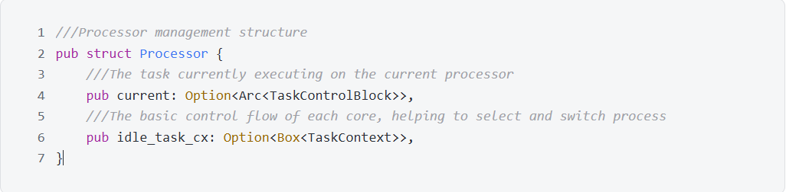
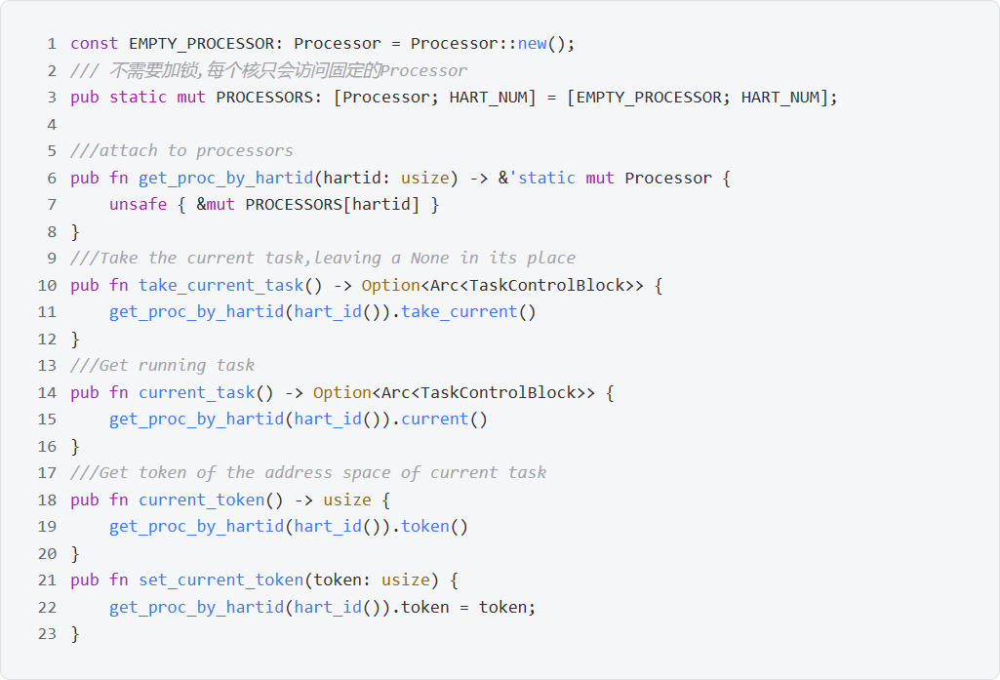
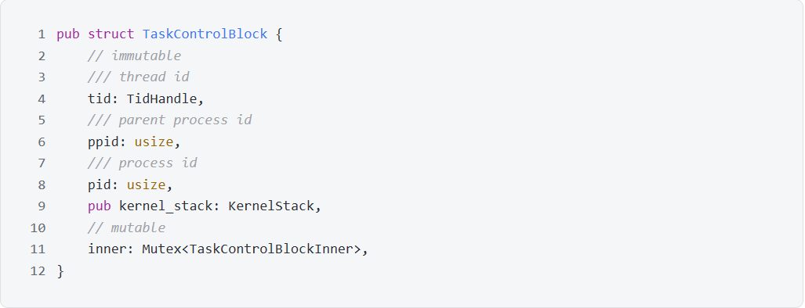
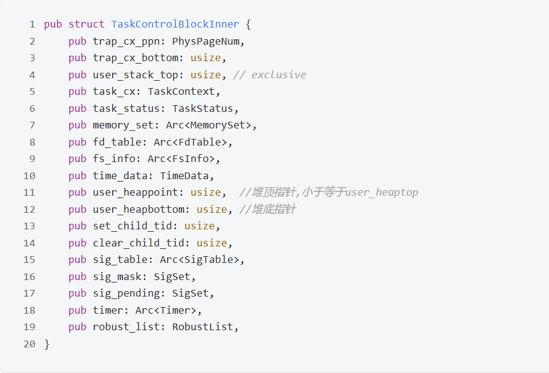
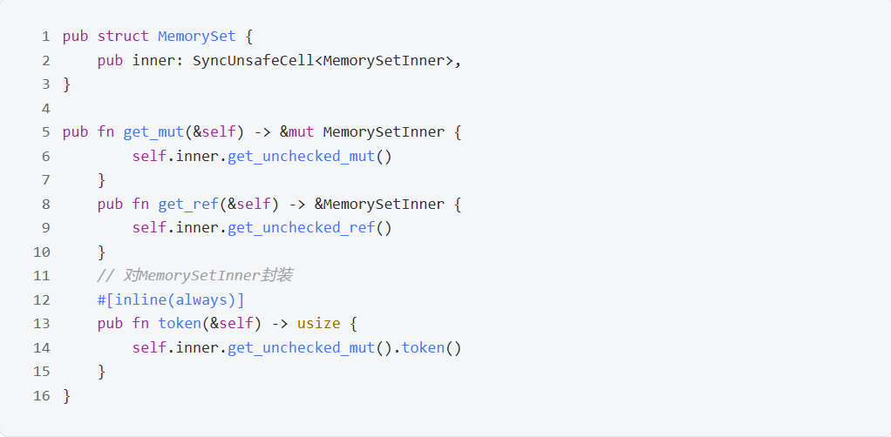
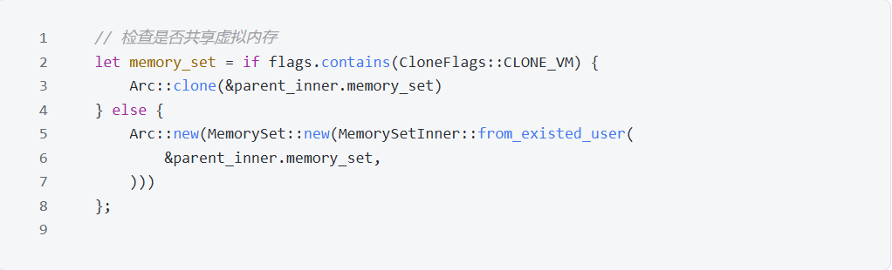

# 3 进程管理

## 3.1 处理器结构
TrustOs将Cpu抽象为Processor结构, Processor由tp寄存器索引, 是进程的载体, 保存有进程的运行上下文和页表token。通过该结构, 可以方便地控制任务转换。  

*   current: 标识当前CPU上的进程, 可能为空, 所以用Option包裹。
*   idle_task_cx: 每个核的基础控制流, 帮助选择并切换进程。

使用数组存放多个Processor, 通过hart_id即tp寄存器的值索引, 因此每个cpu只会访问到固定的Processor, 不需加锁, 无并发冲突

通过函数API对外隐藏PROCESSORS的存在, 避免手动操作带来的异常。
*   take_current_task: 获取当前task
*   current_task: 获取当前task的拷贝
*   current_token: 获取当前token

## 3.2 进程和线程
TrustOs的进程与线程模型与Linux保持一致, 采用轻量级进程的方式实现, 即同一进程的多个线程可以共享地址空间, 文件描述符表以及待处理信号等。
使用TaskControlBlock结构标识轻量级进程, 将其分为可变与不可变的两部分:  
*  不可变部分:
   *  pid: 进程id
   *  ppid: 父进程id
   *  tid: 线程id
   *  kernel_stack: 进程的内核栈空间

*  可变部分:
   *  用户空间相关:
      *  user_stack_top: 用户栈顶
      *  user_heappoint: 用户堆顶端
      *  user_heapbottom: 用户堆底端
   *  进程相关:
      *  parent: 父进程指针
      *  children: 子进程指针
   *  任务调度相关:
      *  trap_cx_ppn: 用户态陷入内核以及从内核返回时保存寄存器信息
      *  task_cx: 线程运行信息
      *  task_status: 线程运行状态
   *  内存相关:
      *  memory_set: 地址空间
   *  文件相关:
      *  fd_table: 文件描述符表
      *  fs_info: 文件系统信息
   *  系统调用相关:
      *  time_data: 记录在内核以及用户空间的时间, 用于时间系统调用
      *  set_child_tid: 用于set_child_tid
      *  clear_child_tid: 用于clear_child_tid
      *  sig_table: 信号处理函数表
      *  sig_mask: 被屏蔽的信号
      *  sig_pending: 待处理的信号
      *  timer: 计时器
      *  robust_list: futex队列

所有在线程创建时可以共享的资源, 例如memory_set, fd_table等, 都用Arc指针包裹, 实现自动的引用计数和RAII。同时为了满足内部可变性的要求, 将可变部分提取为单独的Inner数据结构, MemorySet实际上是`SyncUnsafeCell<MemorySetInner>`。在外层MemorySet为所有内层的方法调用提供封装和快捷访问。如下图所示。

## 3.3 进程调度
在TrustOs中, 进程有四种状态:
*   Ready: 就绪状态, 可以被调度
*   Running: 运行状态
*   Blocked: 阻塞状态,睡眠在futex
*   Zombie: 资源已被回收, 等待被父进程彻底删除

TrusOs目前使用时间片轮转调度算法, 采用一个全局的双端任务队列, 依次从队列头部取出待调度进程并执行。当用户程序因为时间片用完而返回内核时, 放弃该轮执行并被重新加入调度队列的尾部。 

为了提高执行效率, 对于会阻塞的系统调用, 例如sleep, read, write等, 进程会及时地让出cpu, 直到条件就绪后才会再次被调度运行。 
 
TrustOs下一步预计跟Linux对齐, 采用多级反馈算法优化调度。  

## 3.4 线程管理
TrustOs实现了线程组, 父进程子进程组以及对每个线程的追踪。一个进程如果被新创建, 那么它的首线程会被插入新的线程组和父进程的子进程组, 如果是线程被创建, 会被插入进程对应的线程组。

每个线程退出后只会回收线程单独分配的资源: trap_cx和user_stack, 线程组即进程共享的资源会等线程组中所有的线程都退出后被回收。

线程与线程之间通过信号通信。

## 3.5 进程创建与线程创建
根据标志位检查资源是否需要被新创建的线程共享,如果需要,则指向同一份资源;不需要,则拷贝资源

