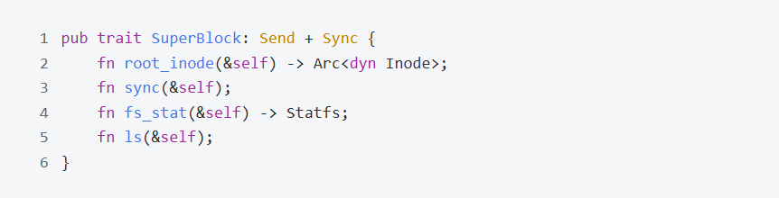
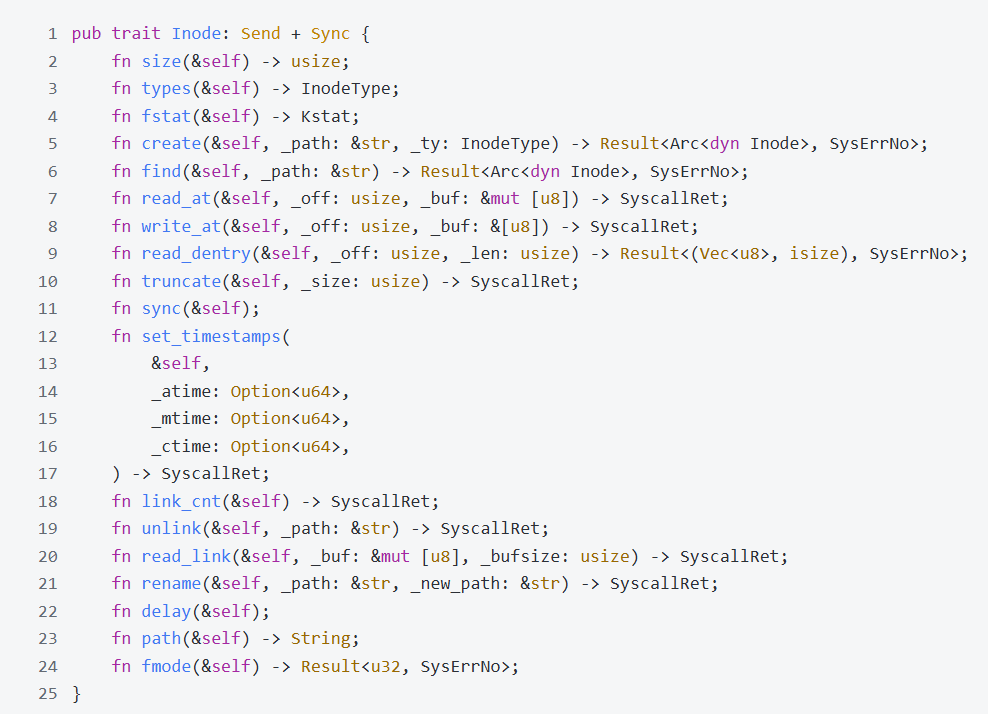
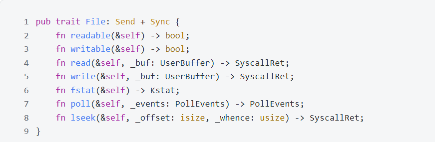
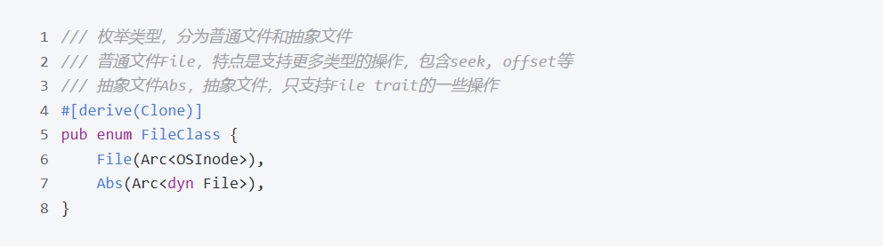
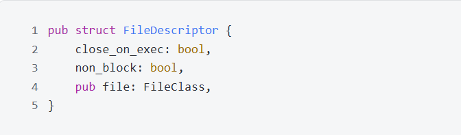
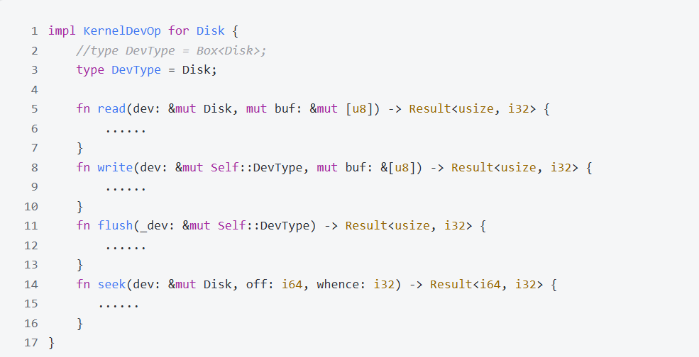
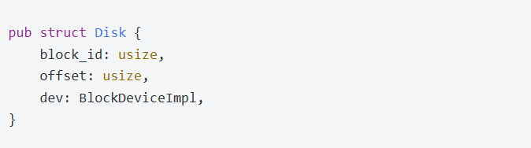
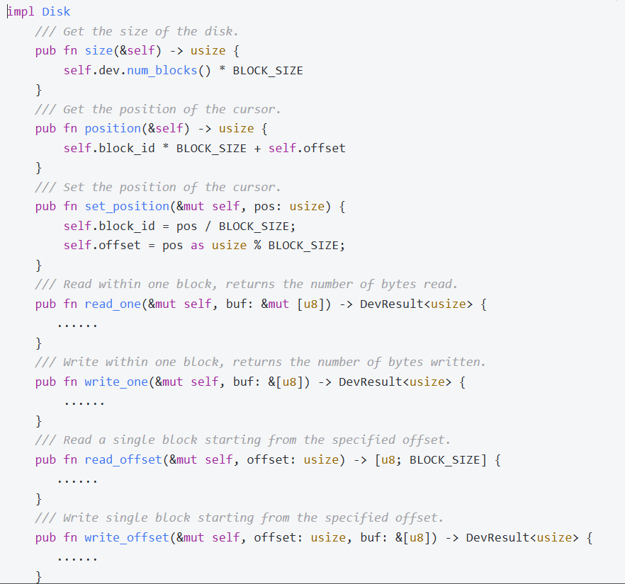

# 4 文件系统

## 4.1 演变历程
1. 初赛要求使用Fat32文件系统,TrustOS使用从jkkos移植的fat32文件系统,并平稳运行,通过了初赛所有测试。
2. 复赛要求切换到Ext4文件系统,此时发现原有的文件系统耦合度过高,在文件相关的系统调用中暴露了过多的实现细节,不利于兼容多个不同的文件系统。
3. 在原有的Fat32文件系统的基础上开始解耦合,设计了一套VFS Trait,并为Fat32实现;使用新接口修改系统调用。
4. 移植lwext4_rust文件系统,对接VFS。

## 4.2 VFS设计
### 4.2.1 SuperBlock
SuperBlock对应文件系统的管理器,负责提供文件系统信息,对外提供根节点以及将文件系统的更改刷盘。

### 4.2.2 Inode
Inode对应的是具体的文件系统中的文件,在Fat32中是VFile,在Ext4中是Ext4File;Inode Trait要求对具体的文件结点的增删查改操作进行封装,封装后便于上层的统一调用

### 4.2.3 File
File对应在内核中使用的文件,不管是具体的文件系统文件OSFile,还是抽象的文件,管道或设备等,都由File提供统一的抽象

## 4.3 FileClass与FileDescriptor
部分操作只有磁盘文件才具有,不应该放入File Trait,因此引入FileClass将具体文件和抽象文件区分。

FileDescriptor是对fd这一file handler的封装,一个fd对应的不仅有文件,还有close_on_exec和non_block标志位

## 4.4 LwExt4库
lwext4库是使用C语言编写的库,为了在TrustOs中使用,需要提供FFI代码,也即胶水代码,负责不同语言之间的交互。StaryOS已经为lwext4库编写相关绑定代码,并发布了lwext4_rust库,在此基础上,并对外提供了KernelOp和DevType两个接口,只需实现相关接口即可。

## 4.5 块设备读写层
fat32文件系统中一个磁盘块为512字节,ext4文件系统中一个磁盘块为4096字节,为了兼容多个文件系统,提供统一的磁盘读写抽象Disk,由Disk结构来读写真正的磁盘设备。Disk保存真正的块设备的引用,以及当前所在的块索引和偏移量

Disk需要向上层提供读写指定块,或从指定偏移量读写,以及容量大小相关信息的接口

