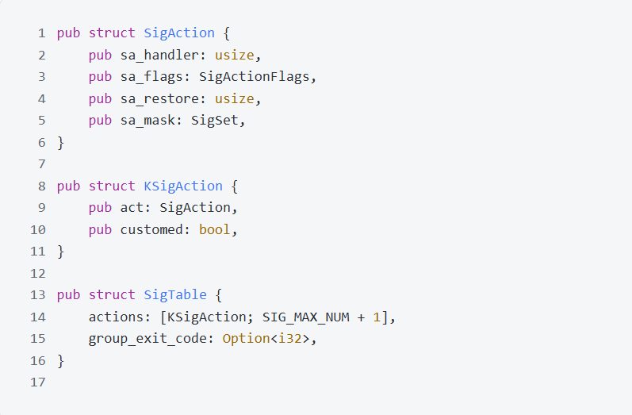
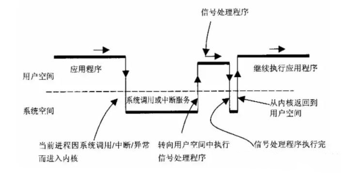
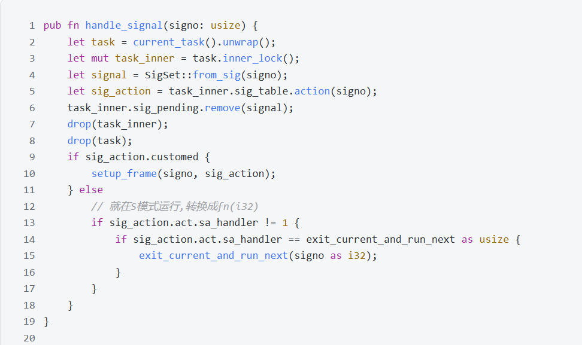
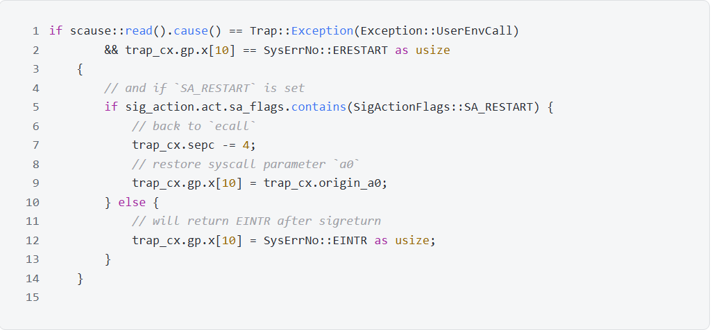
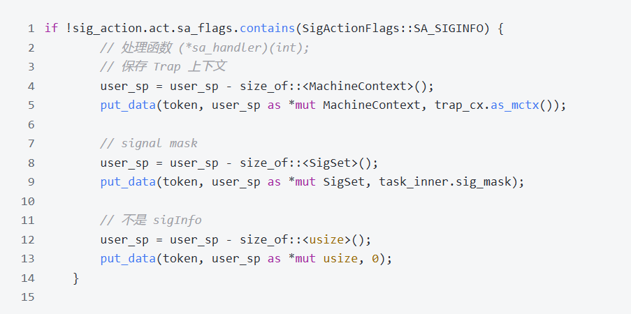
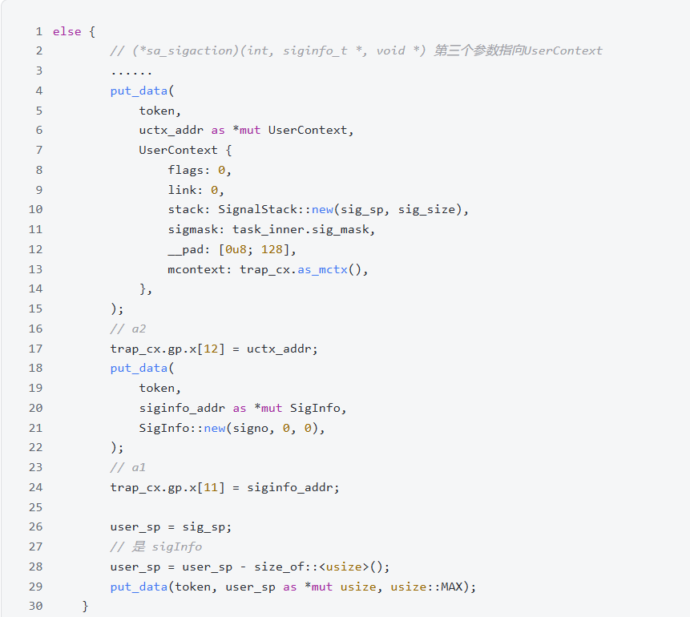
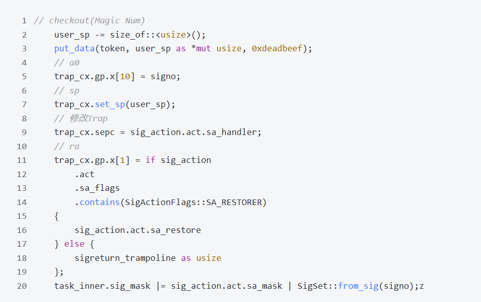

# 5. 信号机制
信号是进程间通信机制中唯一的异步通信机制, 一个进程不必通过任何操作来等待信号的到达, 事实上, 进程也不知道信号到底什么时候到达。进程之间可以互相通过系统调用kill发送软中断信号。内核也可以因为内部事件而给进程发送信号, 通知进程发生了某个事件。信号机制除了基本通知功能外, 还可以传递附加信息。

## 5.1 数据结构
参照Linux5.12的signal源码, 简化合并了部分数据结构, 实现TrustOs的信号机制。

SigAction结构体与Linux的sigaction结构体保持一致, sa_handler 即用户自定义处理函数, sa_flags 即相应的标志位, sa_restorer为当用户自定义处理函数运行完毕后跳转的地址, sa_mask 为运行该信号处理函数时需要阻塞的信号。  

KSigAction结构体, 我们添加一个用户自定义的标志来区分是默认处理函数还是用户自定义处理函数。

SigPending结构体存储对信号的处理函数,group_exit_code存储一个进程的多个线程的退出码 ,actions 则是信号表, 使用时根据信号的编号直接调用即可。

## 5.2 信号处理
信号的处理过程如下图所示。

处理时需先保存帧, 然后返回用户空间, 再次陷入内核恢复帧, 随后返回用户空间继续执行; 不管是地址空间的切换还是保存帧开销都很大, 因此TrustOs细化对信号的处理: 如果信号的处理函数是用户自定义的, 那么正常执行; 若是内核默认处理函数, 直接在内核执行, 不返回用户空间。代码如下图所示。

处理自定义信号的setup_frame函数分为三个步骤执行

1. 检测待处理的信号是否是因为管道检测到信号需要处理而提前退出所产生的,若是,需要重新执行管道相关操作,即重新执行相关syscall。只需要将sepc寄存器的值减去一条指令的长度,随后还原a0寄存器的调用参数即可。

2. 检测信号标志位是否含有SIGINFO,若没有,只需要保存trap上下文和sigmask即可;如有,需要保存UserContext和SigInfo结构,并且将a2寄存器指向UserContext,a1寄存器指向SigInfo

不含SIGINFO的信号处理代码如下图所示

含SIGINFO的信号处理代码如下图所示

3. 根据RISC-V特权级规定, sepc寄存器的地址在从内核返回用户空间时会用作PC指针的值, 所以设置为信号处理函数的地址; 处理完毕后再次返回内核, 需通过跳板页面执行sig_return返回, 所以将返回地址寄存器x1设置为sigreturn_trampoline;若是用户自定义了sa_restore,并且信号含有该字段,使用用户提供的sa_restore; 将sp寄存器设置为最新值, 将调用返回值依照POSIX标准设置为signo;最后,信号处理结束,屏蔽该信号

