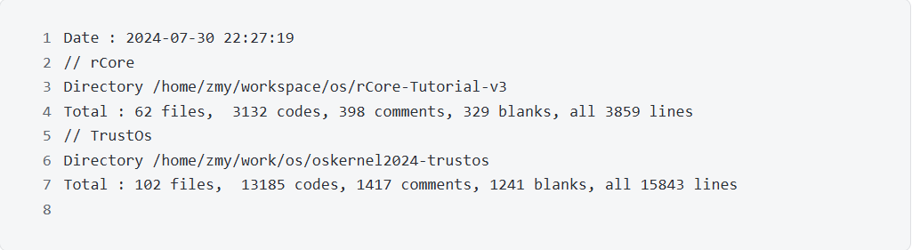
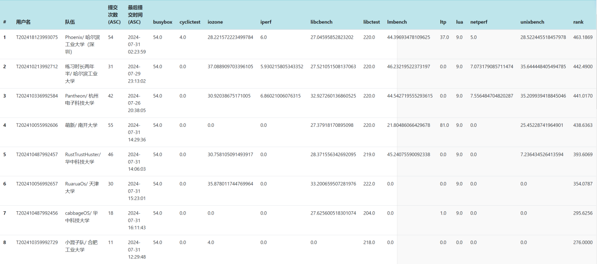

# 6. 总结与展望
## 6.1 总结
TrustOs以rCore-Tutorial Chapter6为基础重构内存管理, 实现并发控制和信号机制, 使用LwExt4文件系统, 添加修改系统调用以满足POSIX标准。  

截止至2024.7.31, 除去文件系统外, rCore chapter_6共计62个文件, 3132行代码, 398行注释;  TrustOS final_main分支共计102个文件,13185行代码。   

TrustOS由rCore原有的11个非POSIX的syscall拓展到105个满足POSIX标准的syscall。

在复赛排行榜中排名第五，分数为393.6069

   
## 6.2 展望
    优化并发和文件IO
    实现网络模块,移植Redis应用
    开启GPU