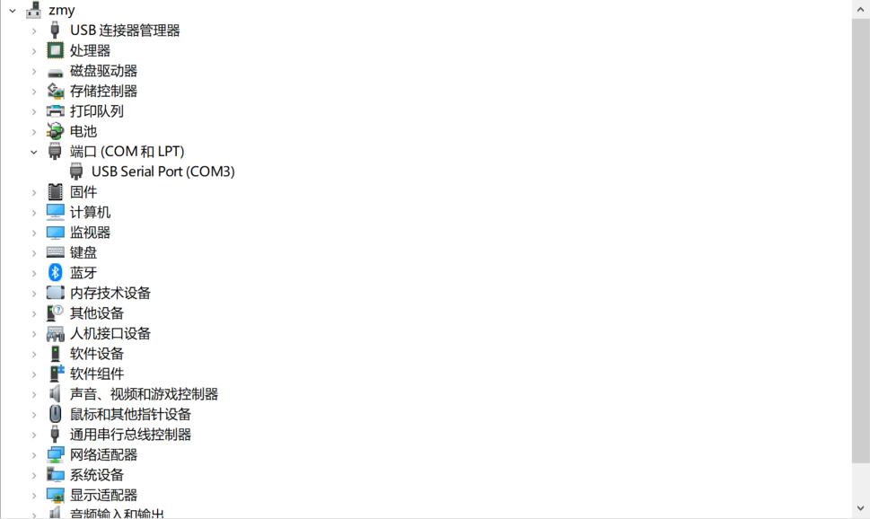
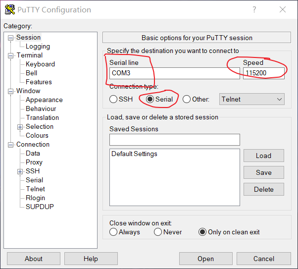
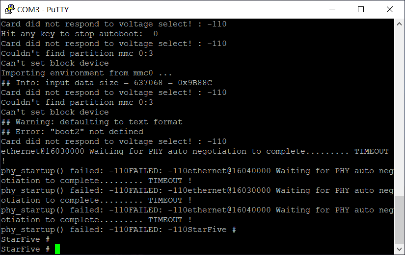
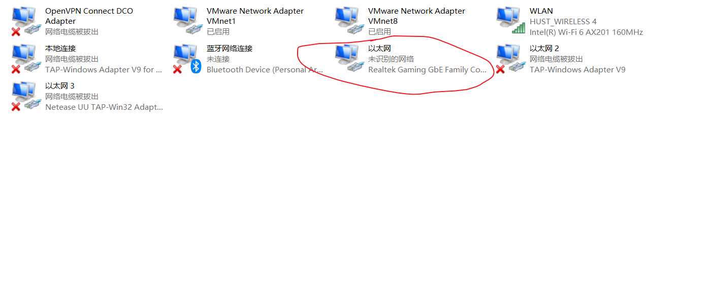
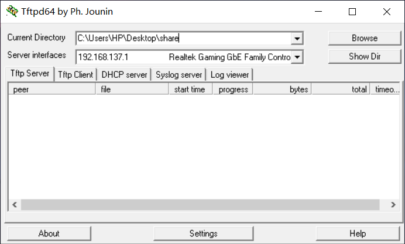
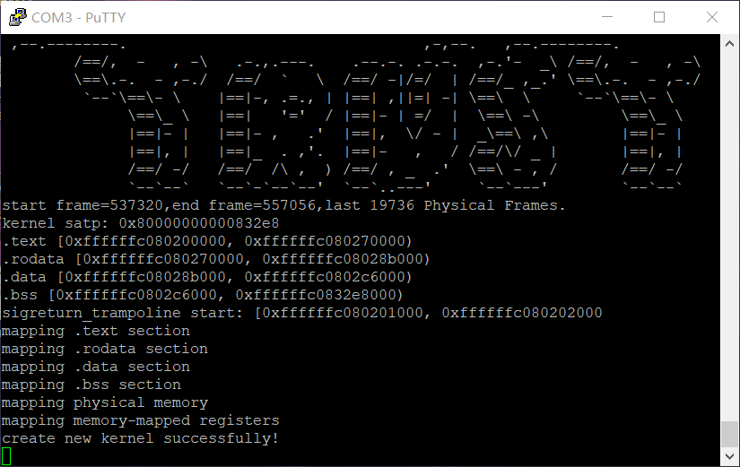

# VisionFive2 上板纪实

## 设备
1. 主机: Windows10
2. 板子: RISCV64-VisionFive2
3. 外设: TypeC线(供电),USB转TTL串口线(调试),网线

## 参考资料
1. [VisionFive2快速入门](./assert/VisionFive2_QSG.pdf)
2. [Windows-tftp搭建](https://blog.csdn.net/weixin_44550536/article/details/131714211)
3. [USB-TTL串口连接示意图](https://doc.rvspace.org/VisionFive2/SDK_Quick_Start_Guide/VisionFive2_SDK_QSG/running_via_network%20-%20vf2.html)

## tftp 上板流程
1. 连接串口线和Type-C线到主机
2. 在Windows10设备管理器中找到端口栏,找到连接好的USB serial,在我的主机上是Com4端口

    

3. 使用[Putty](https://www.chiark.greenend.org.uk/~sgtatham/putty/latest.html)(SSH和TelNet客户端)连接到开发板。选择ConnectionType为Serial,随后设置SerialLine和Speed,最后点击Open按钮。

    

4. 按压Type-C口边上的按钮,启动开发板,进入Uboot界面

    

5. 连接网线,查看网络设备。插入网线后查看Windows网络设备管理器,开发板网段要和被启用的网络保持一致。在我的主机上,对应以太网。

    

6. 查看以太网对应的网段
    ```
    Ethernet adapter 以太网:

    Connection-specific DNS Suffix  . :
    Link-local IPv6 Address . . . . . : fe80::ee8b:a80:1772:c9f3%13
    IPv4 Address. . . . . . . . . . . : 192.168.137.1
    Subnet Mask . . . . . . . . . . . : 255.255.255.0
    Default Gateway . . . . . . . . . :

    ```

7. 设置开发板网络信息,检测网络连接。使用如下命令:
    ```
    setenv ipaddr 192.168.137.223  设置开发板ip
    setenv serverip 192.168.137.1  设置服务器地址
    saveenv                        保存环境变量
    ping 192.168.137.1             如果显示Host is Alive则表示网络连接成功
    ```

8. 使用tftp服务器传输文件,选用[Tftpd64](https://bitbucket.org/phjounin/tftpd64/downloads/)。使用tftpd64前需要设置当前路径和网络接口。当前路径用于存放需要传输的文件,例如os.bin;网络接口设置为以太网(步骤6中的网络设备)。将要传输的文件存放到当前路径。

    

9. 传输并启动内核文件。使用如下命令后可以看到内核顺利启动。
    ```
    tftpboot 0x80200000 os.bin  存放地址与qemu起始地址保持一致
    go 0x80200000               跳转到指定地址并开始执行程序
    ```

    